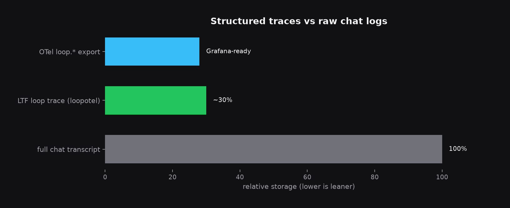

<div align="center">

# Loop Observability

**Loop Trace Format (LTF)** and OpenTelemetry conventions for production loop monitoring.

SREs need spans for iterations, evaluators, token burn, and LES deltas — not raw chat logs. This repo defines the format and ships `loopotel`, a minimal Python instrumentation library.

<br>

[](https://github.com/KanakMalpani/loop-observability/actions/workflows/test.yml)
[](https://pypi.org/project/loopotel/)
[](LICENSE)

<br>

```bash
pip install loopotel
pip install "loopotel[loopgym]"   # LoopGym episode tracing
pip install "loopotel[otlp]"      # OTLP export
```

<br>

[**Quick start**](#quick-start--trace-a-loopgym-run) · [**API docs**](specs/otel-semconv-loop.md) · [**Grafana**](examples/grafana-dashboard.json) · [**LoopNet tutorial**](https://github.com/KanakMalpani/loopnet/blob/main/guides/END-TO-END-TUTORIAL.md)

</div>

---

## Trace footprint

Structured LTF traces capture iteration quality and cost — not every token of every prompt.

<div align="center">
  
</div>

| Format | What you store | Relative size |
| :--- | :--- | ---: |
| Full chat transcript | prompts + completions + tool I/O | 100% |
| **LTF loop trace** | spans, scores, termination | **~30%** |
| OTel `loop.*` attrs | Grafana / OTLP dashboards | export-ready |

---

## ⚡ Quick start — trace a LoopGym run

```python
import loopgym as lg
from loopotel.integrations.loopgym import run_traced_episode
from loopotel.exporter.jsonl import JsonlExporter

env = lg.make("loopbench/code-repair-v1")
result, trace = run_traced_episode(env, task_id="cr-001", seed=42, enabled=True)

JsonlExporter("traces.jsonl").export(trace)
print(result["success"], trace["trace_id"])
```

Or run the example:

```bash
pip install loopgym loopotel
python examples/export_loopgym_ltf.py
```

---

## 💻 API

```python
from loopotel import LoopTracer, emit_iteration, trace_loop

with LoopTracer(loop_name="my-loop", env_id="prod/agent") as tracer:
    emit_iteration(iteration=1, goal_score=0.55, tokens_delta=120,
                   worker_id="implementer", evaluator_id="rubric")
    tracer.finish(outcome="success", termination_reason="goal_met")

trace = tracer.build_trace()  # ltf/0.1 document
```

---

## 📋 Specs

| Document | Purpose |
|----------|---------|
| [`specs/ltf-0.1.schema.json`](specs/ltf-0.1.schema.json) | LTF JSON schema |
| [`specs/otel-semconv-loop.md`](specs/otel-semconv-loop.md) | `loop.*` OTel attributes |
| [`specs/les-timeseries.md`](specs/les-timeseries.md) | Point-in-loop LES metrics |

---

## 📊 Grafana

Import [`examples/grafana-dashboard.json`](examples/grafana-dashboard.json) for iteration vs goal score, cumulative LES, and token burn panels (sample data included).

---

## 🔍 Validate

```bash
loopotel-validate examples/sample-trace.jsonl
python scripts/validate_ltf.py path/to/trace.json
```

---

## 🎨 Design

- **Minimal overhead** — tracing off by default; pass `enabled=True` for SimEnv, use `trace_live_episode()` for LiveEnv
- **Exporters** — JSONL (built-in), OTLP (optional), LoopNet trajectory mapping
- **Pins** — `lss@1.1.0`, `les@1.0.0`, `ltf@0.1.0`

---

## 🔗 Links

- [LoopNet end-to-end tutorial](https://github.com/KanakMalpani/loopnet/blob/main/guides/END-TO-END-TUTORIAL.md) — HF → replay → LoopBench
- [Loop Core Engineering](https://github.com/KanakMalpani/Loop-Core-Engineering) — LES / LSS
- [LoopGym](https://github.com/KanakMalpani/LoopGym) — instrumentation target
- [LoopNet](https://github.com/KanakMalpani/loopnet) — trajectory corpus export

---

## 📝 Citation

```bibtex
@software{loopotel2026,
  title={Loopotel: OpenTelemetry conventions and tracing for LSS loops},
  author={Malpani, Kanak},
  year={2026},
  url={https://pypi.org/project/loopotel/}
}
```

<div align="center">

<sub>MIT · v0.1.0 · <a href="CONTRIBUTING.md">Contributing</a></sub>

</div>
